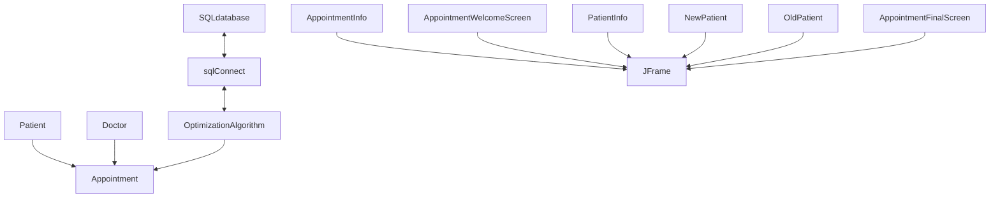

# DocOptimizer - Space
## how to install and run the program
after downloading/cloning the repository on your computer open the command prompt window and type the following commands
- cd _the directory path where the repo is on your device_
- mvn clean install
- java -jar doc-optimizer-1.0-SNAPSHOT.jar
  
## after opening - user instructions
- enter your (patient) info
- choose a doctor and a time for your appointment
- book it or get the closest available time

## repository structure
 - src
   * main
     + contains all of the main classes, optimization algorithm and GUI classes 
   * test
     + contains all the tests for the classes mentioned above
  - misc files used for the database and readme file

## UML-Mermaid Diagram

## Data structures and algorithm
- online sql database
   * Tables:
      + Doctor
      + Appointment
      + Patient
- Optimization Algorithm
   * receives 2 **lists** (Doctor,Appointment) from the database through the sqlConnect class and finds the closest availability
- GUI
  * Welcome window
  * Patient info
  * New patient
  * Appointment info
  * Appointment final screen
  * (if patient info exists --> old patient)
    
